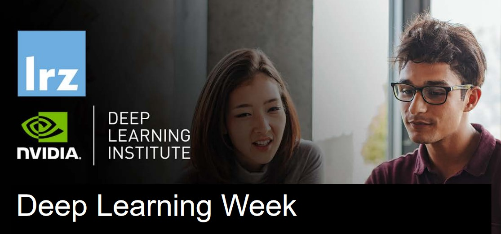

## Table of Contents
1. [Description](#description)
2. [Information](#information)
3. [Certificates](#certificates)

## Description

This online workshop combined lectures about Fundamentals of Deep Learning for single and for Multi-GPUs, Building Transformer-Based Natural Language Processing Applications and Deep Learning on LRZ systems.

The lectures were interleaved with many demos and hands-on sessions using Jupyter Notebooks. For days 1 to 4, the exercises were done in a fully configured GPU-accelerated workstation in the AWS cloud and on day 5 the LRZ AI System resources were used.

The overall goals of this intensive course week, packed with lectures about Deep Learning and AI, were the following:
> - train and deploy deep neural networks to solve computer vision problems;
> - deep understanding about the fundamentals of machine learning for working with texts;
> - practical knowledge how to use transformer-based natural language processing models for advanced tasks involving languages (e.g., categorising documents);
> - learn how to effectively parallelize training of deep neural networks on single and Multi-GPUs;
> - understand how to leverage the LRZ AI Systems to perform all the above tasks.

This course was co-organised by LRZ and NVIDIA Deep Learning Institute (DLI). Material developed by NVIDIA was supplemented by vendor-neutral material developed by LRZ. All instructors were NVIDIA certified University Ambassadors.

## Information

All necessary information, links and lesson slides for the course can be found on the [course website](https://doku.lrz.de/display/PUBLIC/Deep+Learning+Week+@+LRZ+2022).

The exercises and assessments can be found in this repository and are organized in their respective folders, one for each day of the course:
- [Day 1 - Fundamentals of Deep Learning;](https://github.com/HROlive/Deep-Learning-Week-Course/tree/main/Day%201%20-%20Fundamentals%20of%20Deep%20Learning)
- [Day 2 - Fundamentals of Deep Learning for Multi-GPUs;](https://github.com/HROlive/Deep-Learning-Week-Course/tree/main/Day%202%20-%20Fundamentals%20of%20Deep%20Learning%20for%20Multi-GPUs)
- [Day 3 - Fundamentals of machine learning for working with texts;](https://github.com/HROlive/Deep-Learning-Week-Course/tree/main/Day%203%20-%20Fundamentals%20of%20machine%20learning%20for%20working%20with%20texts)
- [Day 4 - Building Transformer-Based Natural Language Processing Applications;](https://github.com/HROlive/Deep-Learning-Week-Course/tree/main/Day%204%20-Building%20Transformer-Based%20Natural%20Language%20Processing%20Applications)
- [Day 5 - Deep Learning on LRZ Systems;](https://github.com/HROlive/Deep-Learning-Week-Course/tree/main/Day%205%20-%20Deep%20Learning%20on%20LRZ%20Systems)

A detailed description of the contents covered during this course can be found on the [registration website.](https://app1.edoobox.com/en/LRZ/Online%20Courses/Online%20Course.ed.e4cafa37d0c0_6397755004.Deep%20Learning%20Week)

## Certificates

The certificates for the workshop can be found below:

- ["Deep Learning Week" - Leibniz Supercomputing Centre](https://github.com/HROlive/Deep-Learning-Week-Course/blob/main/images/Certificate.pdf) (Issued On: July 2022)
- ["Fundamentals of Deep Learning" - NVIDIA Deep Learning Institute](https://learn.learn.nvidia.com/certificates/66196fa09e114717aeb825cb30b72d63) (Issued On: July 2022 - date mismatch because of account change)
- ["Fundamentals of Deep Learning for Multi-GPUs" - NVIDIA Deep Learning Institute](https://learn.learn.nvidia.com/certificates/6a361b6f1c5d45b3a973d5145ad41729) (Issued On: July 2022 - date mismatch because of account change)
- ["Building Transformer-Based Natural Language Processing Applications" - NVIDIA Deep Learning Institute](https://learn.learn.nvidia.com/certificates/ff4b2c501b794358a6677cb3d724b083) (Issued On: August 2022 - date mismatch because of account change)
